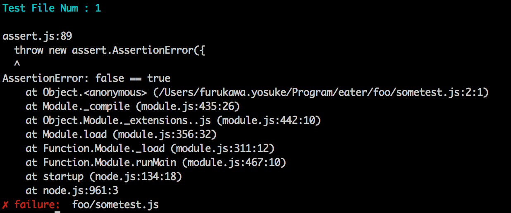

Eater
===============
[](https://travis-ci.org/yosuke-furukawa/eater)
[](https://coveralls.io/github/yosuke-furukawa/eater?branch=master)

Eater is **Ea** sy **t** est runn **er** .
Eater has one simple rule.

```
If test file outputs `stderr` message, the test failed.
```

#Features

- Multi-process, All eater test files run in separeted process. And eater don't launch process more than CPU-core number.
- Easy mock, an eater test does not affect the other tests. Sometimes, mock object kills your test.
- Happy async, eater aims to be happy async test. Each eater file will run in `Node.js` child_process, so the tests are always async first. if your tests mix sync and async tests, you will have a headache to maintain the tests.

#How to use

## 1. Install

```
$ npm install eater -g
```

## 2. Write some tests

```js
// test/sometest.js
const assert = require('assert');
assert(1 === 2); // always failure
```

## Run

```
$ eater
```



## If you are power-assert user

### 1. install power-assert and espower-loader

```
$ npm install eater -D
$ npm install power-assert espower-loader -D
```

### 2. enable power-assert

```js
// script/enable-power-assert.js
require('espower-loader')({
    cwd: process.cwd(),
    pattern: 'test/**/*.js'
});
```

### 3. run test with require

```
$ node --require ./script/enable-power-assert.js node_modules/eater/bin/eater.js
```

## If you are babel(JSX) user

### 1. install babel-register

```
$ npm install eater -D
$ npm install babel-register -D
```

### 2. enable babel

```js
// script/enable-babel.js
require('babel-register')({
  ignore: (file) => {
    if (file.match(/node_modules/)) return true;
    return false;
  }
});
```

### 3. run test with require

```
$ node --require ./script/enable-babel.js node_modules/eater/bin/eater.js
```

Note: if you are power-assert and babel user:

```
$ node --require ./script/enable-babel.js --require ./script/enable-power-assert.js node_modules/eater/bin/eater.js
```


## Coverage

### 1. install nyc instead of istanbul

```
$ npm install nyc -D
```

### 2. run test with nyc

```
$ nyc eater
```
